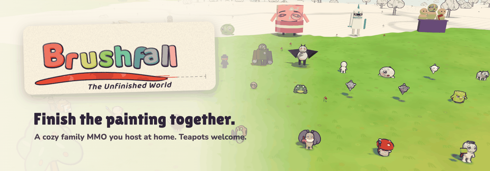
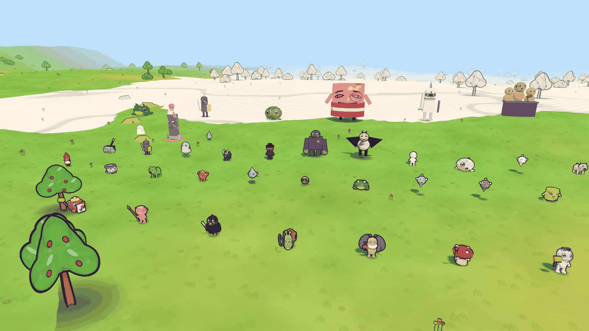
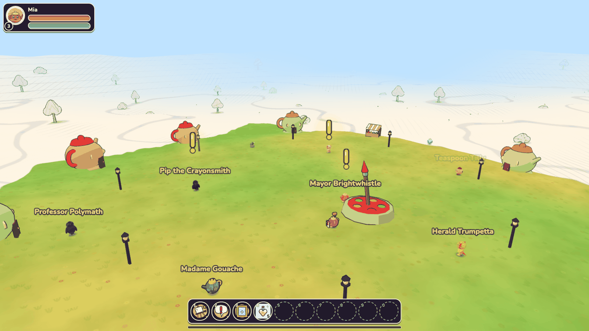
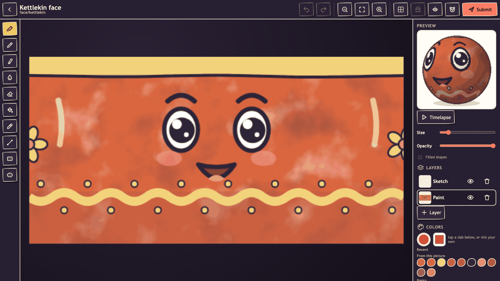
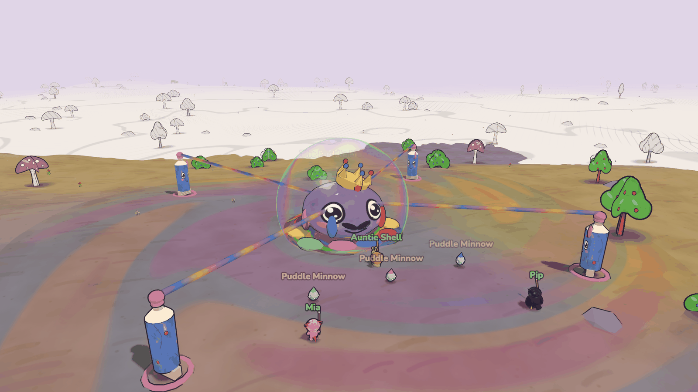
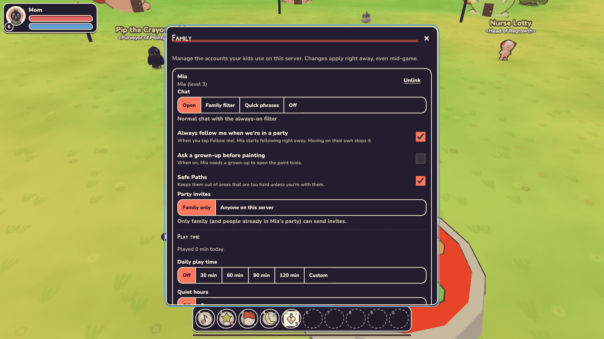
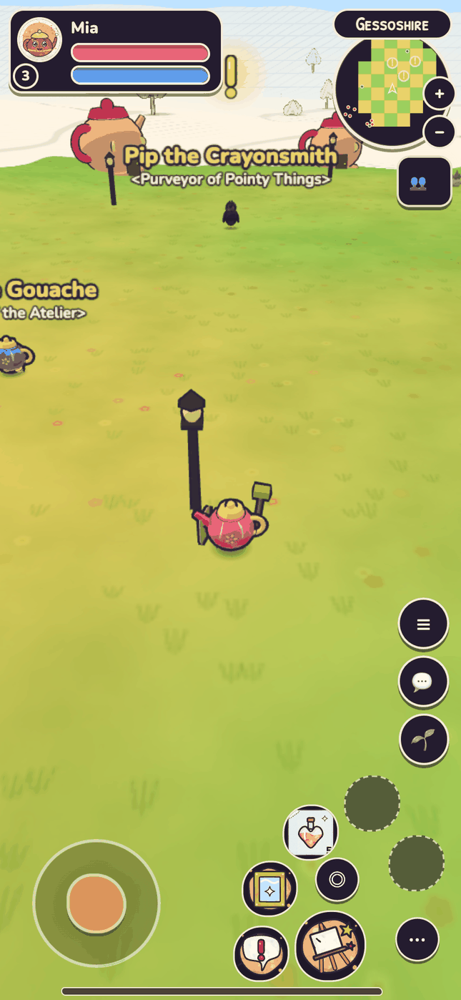
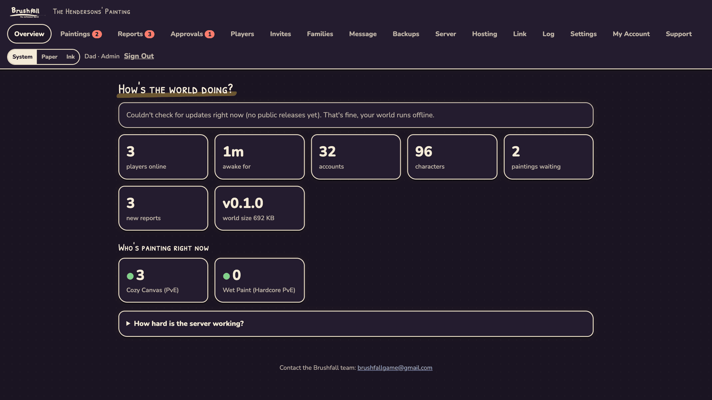

<p align="center">
  
</p>

<p align="center">
  <a href="PREVIEW.md"></a>
  <a href="https://github.com/Twelve47Studios/brushfall_release/wiki/Choosing-a-Setup"></a>
  <a href="https://github.com/Twelve47Studios/brushfall_release/wiki/Family-and-Kid-Safety"></a>
  <a href="https://github.com/sponsors/Twelve47Studios"></a>
</p>

<h3 align="center">A cozy, comedic online adventure for the whole family, on a server you run at home.</h3>

<p align="center">
  <a href="https://github.com/Twelve47Studios/brushfall_release/releases"><b>Download</b></a> ·
  <a href="https://github.com/Twelve47Studios/brushfall_release/wiki/Quick-Start"><b>Quick Start</b></a> ·
  <a href="https://github.com/Twelve47Studios/brushfall_release/wiki"><b>Guides</b></a> ·
  <a href="https://github.com/Twelve47Studios/brushfall_release/wiki/FAQ"><b>FAQ</b></a> ·
  <a href="#support-brushfall"><b>Support</b></a>
</p>

---

The world is a painting, and the Maker who was painting it wandered off mid-stroke. Some of it is bright and still wet. Some of it is pencil sketch. Some of it is blank paper. You and your family are Apprentice Painters (a teapot, an axolotl, a crow, a snail, a moth, a mushroom, or a doodle who woke up early), and every step you take paints the world back in.

Brushfall is the online adventure you loved in your twenties, sized for the family you have now: real quests, real bosses and real teamwork, in sessions that fit between dinner and bath time. It runs in any web browser, on phones and tablets too. No subscriptions, no ads, no shop. **Just your people, a half-painted world, and a teacup who would like you to know he is NOT a mug.**

<p align="center">
  
</p>

## Why families love it

<table>
  <tr>
    <td width="50%" valign="top">
      
    </td>
    <td width="50%" valign="top">
      <h3>🧑‍🧑‍🧒 Play together, whatever their age</h3>
      <p>Explore, quest and team up as a family. Grown-ups get a real adventure with roles, loot and crafting. Kids get funny characters and a world that changes because they showed up.</p>
      <p><b>Sprout mode</b> is for the littlest painters: a 🌱 Sprout hero has a helpful autopilot that follows you and joins in, so a five-year-old can be on the team (and very proud of it) without needing every button. Grandpa can join from his own house, in his browser, with a snail who is slow on purpose.</p>
    </td>
  </tr>
  <tr>
    <td width="50%" valign="top">
      <h3>🖌️ Paint the world. Literally.</h3>
      <p>In the in-game <b>Atelier</b>, anyone can repaint the faces, icons and textures of the world: brushes, fill, layers, undo, a live 3D preview, and a <b>Timelapse</b> button to replay every stroke.</p>
      <p>When a grown-up (a <i>Framer</i>) hangs a painting, it goes live in the world for everyone. Yes, your kid's crayon-faced teapot can walk around town. Yes, they will tell everyone.</p>
      <p>The in-game <b>Gallery</b> keeps every painting your family has hung, with the artist's name and a little "In the world now" badge.</p>
    </td>
    <td width="50%" valign="top">
      
    </td>
  </tr>
  <tr>
    <td width="50%" valign="top">
      
    </td>
    <td width="50%" valign="top">
      <h3>👑 Cozy combat, real teamwork</h3>
      <p>Bosses here don't want to end the world. They have <i>opinions</i>. Meet <b>The Puddle Monarch</b>, a royal puddle who hides in a shield bubble while Paint Totems feed it, hands out Soggy Socks by decree, and demands that EVERYONE gets a puddle.</p>
      <p>Break the totems, keep each other topped up, dodge the splashes, and celebrate together: everyone who helps gets credit, and loot is personal, so nobody squabbles over drops.</p>
      <p>Getting <i>smudged</i> is part of the fun: you touch up at an Easel and try again. Want stakes? The <b>Wet Paint</b> realm gives each hero one life and a portrait in the Hall of Masterpieces.</p>
    </td>
  </tr>
  <tr>
    <td width="50%" valign="top">
      <h3>🛡️ Parent controls, made by a parent's brain</h3>
      <p>Link your kids' accounts and, from the <b>Family</b> panel, choose for each child:</p>
      <ul>
        <li><b>Chat:</b> open (always filtered), stricter family filter, quick friendly phrases only, or off</li>
        <li><b>Safe Paths:</b> keeps them out of areas that are too hard unless they're with you, and shows a paint trail to their next quest</li>
        <li><b>Daily play time</b> and <b>quiet hours</b> (bedtime, enforced by a very polite teapot)</li>
        <li><b>Party invites</b> from family only, and <b>ask a grown-up before painting</b></li>
      </ul>
    </td>
    <td width="50%" valign="top">
      
    </td>
  </tr>
  <tr>
    <td width="50%" valign="top">
      <p align="center"></p>
    </td>
    <td width="50%" valign="top">
      <h3>🔊 Read to me, for kids who can't read yet</h3>
      <p>Turn on <b>Read to me</b> and the game speaks out loud: the guide's tips, quest steps and Safe Paths warnings. It's on automatically for linked child accounts.</p>
      <h3>📱 Plays anywhere</h3>
      <p>Computers, tablets and phones, with mouse and keyboard, a touch joystick, or a game controller. Nothing to install: open the link your family sends you. On a phone you can even add it to your home screen like an app.</p>
    </td>
  </tr>
  <tr>
    <td width="50%" valign="top">
      <h3>🏡 It's your server. Private and ad-free.</h3>
      <p>There is no central Brushfall server. Your accounts, chats and paintings live in one folder on <b>your</b> computer, and only people you approve can join.</p>
      <ul>
        <li>No ads, no microtransactions, no loot boxes, no item shop</li>
        <li>Your server never phones home (it only asks "is there a newer version?")</li>
        <li>Automatic daily backups, and updates in one command</li>
        <li>The <b>Studio Desk</b>: approve sign-ups, hang paintings, read reports, invite family with a QR code</li>
      </ul>
      <p>The only "Are you still watching?" in this game comes from a museum guide whose tour never ends. He means well.</p>
    </td>
    <td width="50%" valign="top">
      
    </td>
  </tr>
</table>

## Host it in 3 steps

You need a computer that's often switched on (a desktop, laptop, NAS, Raspberry Pi 4/5, or a small cloud server) and [Docker](https://docs.docker.com/get-docker/).

**1. Get the two files** (macOS, Linux, Raspberry Pi; Windows commands are in the [Quick Start](https://github.com/Twelve47Studios/brushfall_release/wiki/Quick-Start)):

```sh
mkdir -p ~/brushfall && cd ~/brushfall
curl -fsSLO https://raw.githubusercontent.com/Twelve47Studios/brushfall_release/main/docker-compose.yml
curl -fsSL https://raw.githubusercontent.com/Twelve47Studios/brushfall_release/main/.env.example -o .env
```

**2. Name your world** in `.env` (for example `SERVER_NAME=The Rivera Family Studio`, plus your admin name and password).

**3. Start it:**

```sh
docker compose up -d
```

Open **http://localhost:8080** to play and **http://localhost:8080/admin** for the Studio Desk. Family at home can join at `http://<this-computer's-address>:8080`, or by scanning the QR code on the Studio Desk's **Hosting** tab. It takes about 10 minutes, and most of that is choosing a server name.

👉 **Full walkthrough: [Quick Start](https://github.com/Twelve47Studios/brushfall_release/wiki/Quick-Start)**

<table>
  <tr>
    <td align="center"><a href="https://github.com/Twelve47Studios/brushfall_release/wiki/Windows"><b>🪟 Windows</b></a></td>
    <td align="center"><a href="https://github.com/Twelve47Studios/brushfall_release/wiki/macOS"><b>🍎 macOS</b></a></td>
    <td align="center"><a href="https://github.com/Twelve47Studios/brushfall_release/wiki/Linux"><b>🐧 Linux</b></a></td>
    <td align="center"><a href="https://github.com/Twelve47Studios/brushfall_release/wiki/Raspberry-Pi"><b>🍓 Raspberry Pi</b></a></td>
  </tr>
</table>

Prefer no Docker? Every [release](https://github.com/Twelve47Studios/brushfall_release/releases) also comes as a ready-to-run download (needs Node.js 24 LTS): unzip, then double-click `start.cmd` on Windows or run `./start.sh`.

**Next steps:** [Becoming the Admin](https://github.com/Twelve47Studios/brushfall_release/wiki/Becoming-the-Admin) · [Inviting Your Family](https://github.com/Twelve47Studios/brushfall_release/wiki/Inviting-Your-Family) · [Family and Kid Safety](https://github.com/Twelve47Studios/brushfall_release/wiki/Family-and-Kid-Safety) · [Playing From Outside Home](https://github.com/Twelve47Studios/brushfall_release/wiki/Playing-From-Outside-Home) (so Grandma can join from her house) · [Realm Link](https://github.com/Twelve47Studios/brushfall_release/wiki/Realm-Link) (two households, one world)

## Requirements

| | |
|---|---|
| **To host** | Docker (Windows, macOS, Linux), or Node.js 24 LTS for the plain download |
| **A family (up to ~20 online)** | Raspberry Pi 4/5 (64-bit, 2 GB+ RAM), an old laptop or a NAS, with about 1 GB of free memory and 2 Mbit/s upload |
| **Bigger groups** | A $5 cloud server handles about 50 players; see [How big a computer do I need?](https://github.com/Twelve47Studios/brushfall_release/wiki/Choosing-a-Setup#how-big-a-computer-do-i-need) |
| **To play** | Any modern web browser on a computer, tablet or phone. Mouse and keyboard, touch, or a game controller |

## Early access

Every release here is an **early-access preview**. It's ready for families to host and play, but it isn't finished: things will change, you may meet a bug or two, and some corners of the world are still being painted in (which, to be fair, is the plot). We aim to carry your world across every update, and your server makes a backup every day. Copy one somewhere safe before you update anyway.

**Free for personal, family and non-commercial hosting** (see [LICENSE.txt](LICENSE.txt) / [License in Plain Words](https://github.com/Twelve47Studios/brushfall_release/wiki/License-in-Plain-Words)). More about what "preview" means is in [PREVIEW.md](PREVIEW.md).

## FAQ

<details>
<summary><b>Does it cost anything?</b></summary>
<br>
No. No ads, nothing for sale in the game, no subscription. Donations are welcome but never unlock anything: everyone plays the same game.
</details>

<details>
<summary><b>Do I need to be technical?</b></summary>
<br>
No. If you can copy and paste a command, you can host it. Start with the <a href="https://github.com/Twelve47Studios/brushfall_release/wiki/Quick-Start">Quick Start</a> or the page for your computer.
</details>

<details>
<summary><b>Is it safe for my kids?</b></summary>
<br>
It's made for them. Only people you approve can join, chat is filtered by default (or limited to friendly phrases, or off), and parents set play time, quiet hours and Safe Paths for each child. Reports about other players stay on your server. See <a href="https://github.com/Twelve47Studios/brushfall_release/wiki/Family-and-Kid-Safety">Family and Kid Safety</a>.
</details>

<details>
<summary><b>Can grandparents in another house play?</b></summary>
<br>
Yes. <a href="https://github.com/Twelve47Studios/brushfall_release/wiki/Playing-From-Outside-Home">Playing From Outside Home</a> shows how, with Cloudflare Tunnel or Tailscale. Neither needs any router fiddling.
</details>

<details>
<summary><b>Is it a kids' game?</b></summary>
<br>
It's a family game: think PG, with heart. Lots of laughs, some real peril and a few emotional moments, best enjoyed together. Nothing gory, nothing mean, nothing scary for its own sake.
</details>

More answers in the **[FAQ](https://github.com/Twelve47Studios/brushfall_release/wiki/FAQ)** and **[Troubleshooting](https://github.com/Twelve47Studios/brushfall_release/wiki/Troubleshooting)**.

## Support Brushfall

Brushfall is free. There are no ads, nothing is for sale in the game, and **donations never unlock anything**. Everyone plays the same game, whether they chip in or not.

If your family enjoys it and you'd like to help keep the paint flowing, you can sponsor the project:

<p>
  <a href="https://github.com/sponsors/Twelve47Studios"></a>
</p>

Not a money moment? That's fine too. Bug reports, ideas (kids' ideas especially) and telling another family all help. See [Supporting Brushfall](https://github.com/Twelve47Studios/brushfall_release/wiki/Supporting-Brushfall).

## Help and contact

- **Questions and hosting help:** [open an issue](https://github.com/Twelve47Studios/brushfall_release/issues/new/choose)
- **Found a bug?** Use **Report a Problem** in the game and forward it from your Studio Desk, or [file a bug report](https://github.com/Twelve47Studios/brushfall_release/issues/new/choose)
- **Security problem?** Please report it privately: see [SECURITY.md](SECURITY.md)
- **Say hi:** brushfallgame@gmail.com (please don't email passwords or invite links)

## Made by Nicholas Schiavi

Brushfall is a personal, independent passion project by **Nicholas Schiavi**: a game made for the people on your couch, with jokes for the kids and a few more for the grown-ups. It's built with love and a lot of paint, and some of it is still drying.

If you play it with your family, Nicholas would love to hear how it went, especially what made everybody laugh. Thank you for helping finish the painting. 🎨

<p align="center"><b>Finish the painting together.</b></p>
